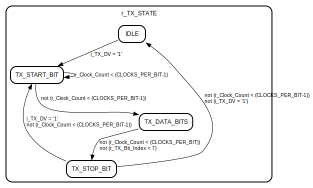

# Entity: UART_TX 

- **File**: uart_tx.vhd
## Diagram

## Generics

| Generic name   | Type    | Value | Description |
| -------------- | ------- | ----- | ----------- |
| CLOCKS_PER_BIT | integer | 217   |             |
## Ports

| Port name   | Direction | Type                         | Description |
| ----------- | --------- | ---------------------------- | ----------- |
| i_Clock     | in        | std_logic                    |             |
| i_TX_Byte   | in        | std_logic_vector(7 downto 0) |             |
| o_TX_Serial | out       | std_logic                    |             |
| i_TX_DV     | in        | std_logic                    |             |
## Signals

| Name           | Type                         | Description |
| -------------- | ---------------------------- | ----------- |
| r_TX_STATE     | UART_TX_STATE                |             |
| r_Clock_Count  | integer                      |             |
| r_TX_Bit_Index | integer range 0 to 7         |             |
| r_TX_Bit       | std_logic                    |             |
| r_TX_Byte      | std_logic_vector(7 downto 0) |             |
## Types

| Name          | Type                                                                                                                                                                                                     | Description |
| ------------- | -------------------------------------------------------------------------------------------------------------------------------------------------------------------------------------------------------- | ----------- |
| UART_TX_STATE | (IDLE,  TX_START_BIT,  TX_DATA_BITS,  TX_STOP_BIT,  CLEANUP) |             |
## Processes
- unnamed: ( i_Clock )
## State machines

