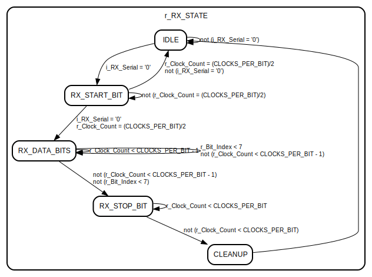

# Entity: UART_RX 

- **File**: uart.vhd
## Diagram

## Generics

| Generic name   | Type    | Value | Description |
| -------------- | ------- | ----- | ----------- |
| CLOCKS_PER_BIT | integer | 217   |             |
## Ports

| Port name   | Direction | Type                         | Description |
| ----------- | --------- | ---------------------------- | ----------- |
| i_Clock     | in        | std_logic                    |             |
| i_RX_Serial | in        | std_logic                    |             |
| o_RX_DV     | out       | std_logic                    |             |
| o_RX_Byte   | out       | std_logic_vector(7 downto 0) |             |
## Signals

| Name          | Type                         | Description |
| ------------- | ---------------------------- | ----------- |
| r_Clock_Count | std_logic_vector(7 downto 0) |             |
| r_Bit_Index   | integer range 0 to 7         |             |
| r_RX_Byte     | std_logic_vector(7 downto 0) |             |
| r_RX_DV       | std_logic                    |             |
| r_RX_STATE    | RX_STATE                     |             |
## Types

| Name     | Type                                                                                                                                                                                                                                                                                       | Description |
| -------- | ------------------------------------------------------------------------------------------------------------------------------------------------------------------------------------------------------------------------------------------------------------------------------------------ | ----------- |
| RX_STATE | (IDLE,  -- waiting for start bit RX_START_BIT,  -- start bit detected RX_DATA_BITS,  -- receiving data bits RX_STOP_BIT,  -- stop bit CLEANUP) |             |
## Processes
- unnamed: ( i_Clock )
## State machines

